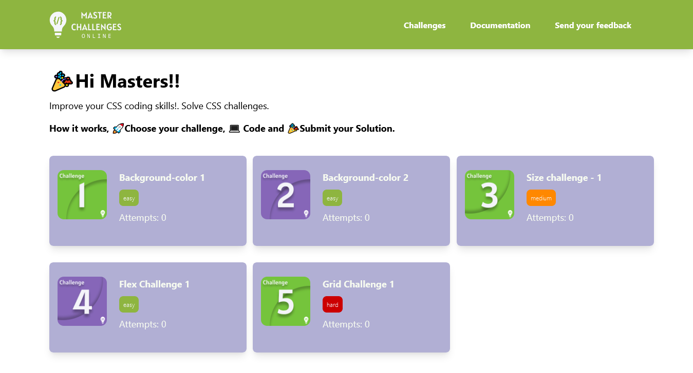

## Hola, I'm Raúl ★
 FullStack Javascript Developer / Software Engineer 

## Contact

 

## About Me

- 🍞 I'm currently looking for opportunities as a Frontend/React/JS Developer.
- 🔭 I’m currently working on [these projects](#projects)
- 🌱 I’m currently learning in <a href="https://platzi.com/blog/conoce-que-es-platzi-master/">
   Platzi Master
</a> 
- 🤔 I’m looking for help with React Performance
- 💬 Ask me about JavaScript and WebComponents
- 📫 Education recent: 
  - Platzi Master Member (mostly React and Javascript courses)
  - Others: Epic React by Kent C Dodds, React Course by Brad Traversy, Advanced React by Wes Bos
- ✈️ Education past:
  - Microsoft Certified (MCP, MCSA)
  - Coursera: iOS and Android Fundamentals
- 🧠 Experience recent: 
  - React, Vanilla Javascript, Puppeteer Web Scrapping, ExpressJS API's, Bull-Redis tasks, MongoDB and RethinkDB
- 😲 Experience past:
  - ASP.NET MVC, EF, Dapper, SQL Server
- ⚡ Fun fact: 日本語を勉強しています

## Projects

### Master CSS Challenges

A Web application where you can learn and upgrade CSS skills solving code challenges.

My job was to develop the way the challenges are validated, in this case we use CSSTree and CSSOM to generate a JSON AST from the user's css code, then we apply a set of rules using JSONata.

Also helped with the implementation of a backend with PolkaJS (ExpressJS alternative) and MongoDB Atlas to provide the challenge information
